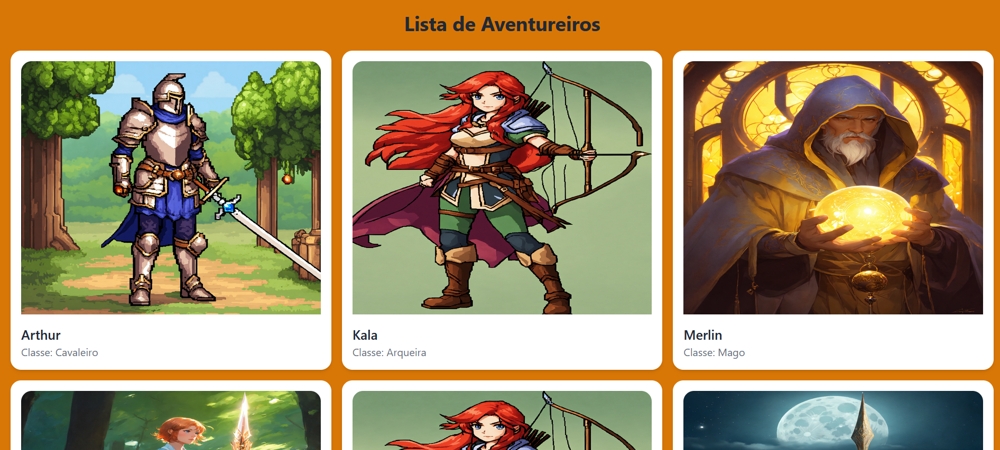
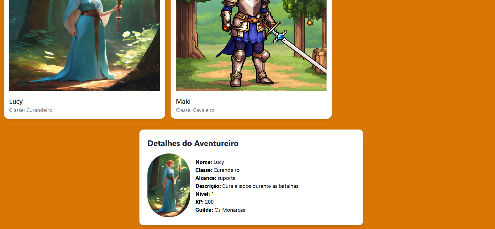

# Database RPG  

Quando comecei a estudar banco de dados, tive certa dificuldade, os exemplos não eram do meu gosto, mas aprendi que o conceito é o mesmo, então, decidi praticar com temas que são mais interessantes para mim, e que compreendo melhor, então, decidi praticar com um banco de dados baseado em RPG.  

Este é um projeto de um sistema para "gerenciar" aventureiros, classes e guildas em um RPG. Ele utiliza **Flask** como framework backend, **PostgreSQL** como banco de dados e **Tailwind CSS** para estilização do frontend. O sistema exibe uma lista de aventureiros com detalhes e imagens, além de permitir a visualização de informações detalhadas de cada aventureiro.  

Esse mesmo modleo de sistema pode ser aplicado a **sistemas de inventário e controle de ativos** ou a **plataformas de gerenciamento de tarefas ou projetos**, por exemplo, pois todos tem a funcionalidade de "ler" um banco de dados e exibir na tela de forma agradavel ao usuário. 

---

## Funcionalidades
A funcionalidade é a mesma que pode ser aplicada um "sistema real" cuja função seja exibir informações de um banco de dados em uma pagina web.
- Exibe uma lista de aventureiros com suas respectivas classes e guildas.
- Visualização de detalhes de cada aventureiro, incluindo imagem, nível, XP, alcance e descrição da classe.
- Integração com banco de dados PostgreSQL para armazenar informações sobre aventureiros, classes e guildas.
- Interface estilizada com **Tailwind CSS**.

---

## Capturas de Tela



---

## Tecnologias Utilizadas

- **Backend**: Flask
- **Linguagem**: Python
- **Frontend**: HTML, JavaScript, Tailwind CSS
- **Banco de Dados**: PostgreSQL

---

## Estrutura do Projeto

```
databaseRPG/
├── static/
│   ├── images/          
│   └── script.js       
├── templates/
│   └── index.html       
├── app.py               
├── schema.sql           
└── README.md            
```

---

## Configuração do Ambiente

### Pré-requisitos

- Python 3.8 ou superior
- PostgreSQL instalado e configurado
- Gerenciador de pacotes `pip`

### Passos para Configuração

1. **Clone o repositório**:
   ```bash
   git clone https://github.com/TheEddu/RPG_database.git
   cd databaseRPG
   ```

2. **Crie e ative um ambiente virtual**:
   ```bash
   python3 -m venv venv
   source venv/bin/activate
   ```

3. **Instale as dependências**:
   ```bash
   pip install flask psycopg2 flask-cors
   ```

4. **Configure o banco de dados**:
   - Crie um banco de dados PostgreSQL chamado `rpg_db`.
   - Execute o script schema.sql para criar as tabelas e popular os dados:
     ```bash
     psql -U usuario -d rpg_db -f schema.sql
     ```

5. **Configure as credenciais do banco de dados**:
   - No arquivo app.py, atualize a variável `DB_CONFIG` com as credenciais do seu banco de dados:
     ```python
     DB_CONFIG = {
         'dbname': 'rpg_db',
         'user': 'usuario',
         'password': 'senha',
         'host': 'localhost',
         'port': 5432
     }
     ```

6. **Inicie o servidor Flask**:
   ```bash
   python app.py
   ```

7. **Acesse o sistema no navegador**:
   - Abra o navegador e acesse: [http://localhost:5000](http://localhost:5000)

---

## Estrutura do Banco de Dados

### Tabelas

1. **Classe**:
   - `id`: Identificador único.
   - `nome`: Nome da classe (ex.: Cavaleiro, Mago).
   - `alcance`: Tipo de alcance (curto, longo, suporte).
   - `descricao`: Descrição da classe.

2. **Guilda**:
   - `id`: Identificador único.
   - `nome`: Nome da guilda.
   - `data_criacao`: Data de criação da guilda.

3. **Aventureiro**:
   - `id`: Identificador único.
   - `nome`: Nome do aventureiro.
   - `classe_id`: Referência à tabela `Classe`.
   - `nivel`: Nível do aventureiro.
   - `xp`: Experiência do aventureiro.
   - `guilda_id`: Referência à tabela `Guilda`.

---

## Funcionalidade do Frontend

- **Lista de Aventureiros**:
  - Exibe os aventureiros em cards com imagem, nome e classe.
  - As imagens são carregadas da pasta images com base no nome da classe.

- **Detalhes do Aventureiro**:
  - Ao clicar em um card, um painel exibe os detalhes do aventureiro, incluindo uma imagem maior, nome, classe, alcance, descrição, nível, XP e guilda. Todos esses dados são "puxados" do banco.

---

## Personalização

- **Imagens dos Aventureiros**:
  - As imagens são adicionadas na pasta images com o nome correspondente à classe do aventureiro (ex.: `Cavaleiro.png`, `Mago.png`).

- **Estilização**:
  - Como o projeto utiliza **Tailwind CSS** qualquer um pode personalizar o estilo diretamente no arquivo index.html.

